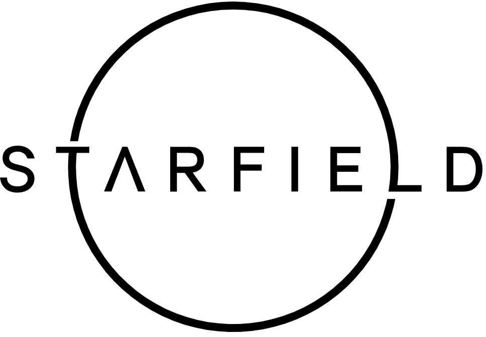

# Starfield Resurrected 2024

<table>
  <tr>
    <td>This is my modlist for Starfield game. First playthrough 2023-2024. I hope you like it and enjoy it as much as I do/did. Please don't forget to endorse the mod authors you like on Nexus.</td><td></td>
  </tr>
</table>

# Essential

| Number | Mod | Brief explanation | Spanish translation |
|----------|----------|----------|----------|
| 1 | [Starfield Script Extender (SFSE).](https://www.nexusmods.com/starfield/mods/106) | Starfield Script Extender (SFSE) is a tool that adds additional scripting capabilities and functionality to the game. | Not needed. |
| 2 | [Baka Achievement Enabler (SFSE)](https://www.nexusmods.com/starfield/mods/658) | We want our achievements back! | Not needed. |
| 3 | [Cleanfield](https://www.nexusmods.com/starfield/mods/88?tab=description) | Gets rid of: Epilepsy & Seizure Warning, Bethesda Logo Video, Bethesda Logo, Message of the Day (optional), Starfield Logo (optional). 30, 60 and 120 FPS, Vortex & MO2 Support | Not needed. |
| Total mods in this category: | 3 | | |

# GUI

| Mod | Brief explanation | Spanish translation |
|----------|----------|----------|
| [StarUI HUD](https://www.nexusmods.com/starfield/mods/3444) | StarUI HUD gives you full control over most HUD widgets and provides an updated loot list and better item cards with DPS and V/W. Resize, move, recolor or disable most of the HUD widgets. The loot list can show additional columns like V/W (sort-able) and show you the item card for hovered items! | [StarUI HUD ESPANOL (Castellano)](https://www.nexusmods.com/starfield/mods/3493) |
| [StarUI Inventory.](https://www.nexusmods.com/starfield/mods/773) | StarUI Inventory improves all inventory screens for use on a PC. Compact display style. More details in sortable columns. Item tag icons. Category as left sidebar. Many quality of life features! | [StarUI Inventory ESPANOL (Castellano)](https://www.nexusmods.com/starfield/mods/2694) |
| [StarUI Workbench](https://www.nexusmods.com/starfield/mods/4966) | StarUI Workbench improves all workbenches with a more compact layout, more information, sortable columns, new data columns, custom layout, recoloring, dark mode, Quality-of-Life features and more! | [StarUI Workbench ESPANOL (Castellano)](https://www.nexusmods.com/starfield/mods/4980) |
| :warning: NOT INSTALLED YET, NO TRANSLATION YET. [StarUI Outpost](https://www.nexusmods.com/starfield/mods/5766) | todo | todo |
| :warning: NOT INSTALLED YET, NO TRANSLATION YET. (Russian translation already done) StarUI Configurator | todo | todo |
| [StarUI Ship Builder](https://www.nexusmods.com/starfield/mods/6402) |  StarUI Ship Builder improves the shipbuilder for usage on PC. A compact style, sortable columns, filter panel, category list, variant list, vertical upgrade list, and many more Quality-of-Life additions. | [StarUI Ship Builder ESPANOL (Castellano)](https://www.nexusmods.com/starfield/mods/6405) |
| [Undelayed Menus.](https://www.nexusmods.com/starfield/mods/404) ([Reviewed here by MxR](https://www.youtube.com/watch?v=nfrWXMk2wIg)). |  This mod's goal is to significantly improve the user experience by enhancing the responsiveness and efficiency of in-game menus. | Not needed. |
| [Enhanced Player Healthbar](https://www.nexusmods.com/starfield/mods/454)  | This mod dynamically changes the player's health bar color at 75%, 50%, and 25%. | Not needed. |

# Presets

| Number | Mod | Brief explanation | Spanish translation |
|----------|----------|----------|----------|
| 1 | [Outpost Showers.](https://www.nexusmods.com/starfield/mods/8140) | Adds 2 new showers for your outposts. | TODO. |
| Total mods in this category: | 1 | | |

# Outposts

| Number | Mod | Brief explanation | Spanish translation |
|----------|----------|----------|----------|
| 1 | [DUNE - Paul Atreides Preset and Hair.](https://www.nexusmods.com/starfield/mods/11441) | Adds a new preset and hairstyle based on Paul Atreides look in DUNE. | TODO. |
| Total mods in this category: | 1 | | |

# Gadgets / enhancements

| Number | Mod | Brief explanation | Spanish translation |
|----------|----------|----------|----------|
| 1 | [Starfield Gadgets.](https://www.nexusmods.com/starfield/mods/8112?tab=files) | Adds standalone watches, wrist tech, headphones, and hats to the game. | TODO. |
| Total mods in this category: | 1 | | |

